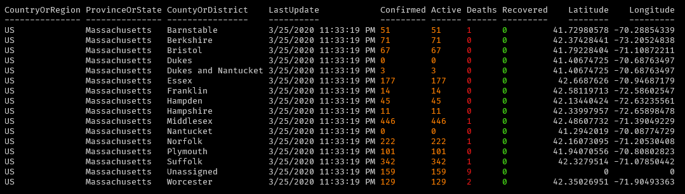

# ReadMe

[](https://ephos.visualstudio.com/PSCOVID-19/_build/latest?definitionId=3&branchName=master)

## PSCOVID-19

This was a project born out of wanting to just write some code as more cases of COVID-19 started popping up throughout the United States.

This uses the same CSV data files in the Johns Hopkins CSSE [GitHub Repository](https://github.com/CSSEGISandData/COVID-19).  This is a side project I just wanted to write to tinker with data, <span style="color:blue">__**I am in NO WAY affiliated with any health organization or Johns Hopkins**__</span>!

## Install and Usage

Installing the module.

```powershell
# Install module.
Install-Module -Name PSCOVID-19 -Scope CurrentUser
```

As of now the module only has limited functionality.

If you want to get all of the data to manipulate it yourself.  Use `Get-COVID19Data`, it will return a list of `[Covid]` objects that you can manipulate with built-in PowerShell Cmdlets.

```powershell
# Gather the latest data
$covidData = Get-COVID19Data

# Filter the data to get all US cases and measure the total amount of confirmed cases across all of the data
$covidData | Where-Object {$_.CountryOrRegion -eq 'US'} | Measure-Object -Property Confirmed -Sum

# For you other New Englanders, Get all the New England states, sort by 'confirmed' cases and then format it out as a table
$covidData | Where-Object {$_.CountryOrRegion -eq 'US'} | Where-Object {
    $_.ProvinceOrState -eq 'Massachusetts' -or
    $_.ProvinceOrState -eq 'Rhode Island' -or
    $_.ProvinceOrState -eq 'Connecticut' -or
    $_.ProvinceOrState -eq 'New Hampshire' -or
    $_.ProvinceOrState -eq 'Vermont' -or
    $_.ProvinceOrState -eq 'Maine'
} | Sort-Object -Property Confirmed -Descending | Format-Table -AutoSize

# Get data for Italy
$covidData | Where-Object {$_.CountryOrRegion -eq 'Italy'}  | Format-Table -AutoSize
```

You can start the "tracker" which updates periodically against the data.  _The data refresh is always dependent on the data that Johns Hopkins is aggregating._

```powershell
# Get all United States cases
Format-Covid19Table -CountryOrRegion US

# Get all the cases for a specific state
Format-Covid19Table -CountryOrRegion US -ProvinceOrState 'Massachusetts'
```

Below is an image of the output using China as an example.


## Links

- [Johns Hopkins GitHub Repository](https://github.com/CSSEGISandData/COVID-19)
- [Coronavirus disease 2019 (COVID-19) Wikipedia](https://en.wikipedia.org/wiki/Coronavirus_disease_2019)
